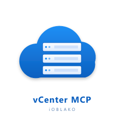

<p align="center">
  
</p>

<h1 align="center">VMware vCenter 8.0 MCP Server</h1>

<p align="center">
  <a href="https://github.com/TheEvalon/vmware-vcenter-mcp/actions/workflows/ci.yml"></a>
  <a href="LICENSE"></a>
  = 22"/>
  
  
</p>

A [Model Context Protocol](https://modelcontextprotocol.io) server that lets
Cursor (or any MCP-compatible client) manage a VMware vCenter 8.0 deployment
end-to-end: read inventory, query statistics, take snapshots, power VMs on
and off, vMotion across hosts, mount ISOs, configure DRS/HA, remediate
clusters with vLCM, and more.

The server fronts three vSphere API surfaces behind a single session:

- **vSphere Automation REST API** (`/api/...`) - primary, modern JSON.
- **VI/JSON API** (`/sdk/vim25/{release}/...`, vCenter 8.0 U1+) - full vim25
  parity for ops not exposed by the Automation API (snapshots, advanced VM
  config, performance counters, alarms, RBAC).
- **vSphere Web Services SOAP** via `@vates/node-vsphere-soap` - lazy
  fallback; exposed through a single `soap_runCommand` escape hatch.

> **Safety first.** Every destructive tool (`*_delete`, `*_powerOff`,
> `snapshot_remove`, `host_reboot`, ...) requires an explicit `confirm: true`
> argument. Otherwise, the tool returns a structured **dry-run** describing
> the exact request that would have been sent, but never touches vCenter.
> A global `VCENTER_READ_ONLY=true` kill switch refuses every destructive
> tool regardless of `confirm`.

---

## Quick start

```powershell
git clone https://github.com/TheEvalon/vmware-vcenter-mcp.git
cd vmware-vcenter-mcp
npm install
copy .env.example .env
# edit .env with your vCenter details
npm run build
npm start
```

For development you can run the server with `tsx`:

```powershell
npm run dev
```

Run the unit test suite:

```powershell
npm test
```

Run the **comprehensive read-only integration suite** against a real vCenter
(recommended pre-publish gate). It spawns the MCP server twice over stdio,
discovers your lab inventory, exercises every read-only tool, dry-runs every
destructive tool, and verifies the `VCENTER_READ_ONLY=true` kill switch
blocks every write path:

```powershell
npm run test:integration:readonly
```

The legacy single-test smoke pass is still available:

```powershell
$env:VCENTER_INTEGRATION = "true"; npm run test:integration
```

---

## Cursor MCP registration

Add this entry to `~/.cursor/mcp.json` (Windows:
`%USERPROFILE%\.cursor\mcp.json`). Replace `<absolute-path-to-clone>` with
the absolute path to your cloned repo:

```json
{
  "mcpServers": {
    "vmware": {
      "command": "node",
      "args": ["<absolute-path-to-clone>/dist/index.js"],
      "env": {
        "VCENTER_HOST": "vcsa.lab.local",
        "VCENTER_USER": "administrator@vsphere.local",
        "VCENTER_PASS": "********",
        "VCENTER_INSECURE": "false",
        "VCENTER_READ_ONLY": "true"
      }
    }
  }
}
```

`VCENTER_READ_ONLY=true` is the recommended starting point: every
destructive tool is blocked globally until you explicitly remove the flag.
See [Safety / dry-run](#safety--dry-run) below.

For development, swap `command: "node", args: ["dist/index.js"]` for
`command: "npx", args: ["tsx", "src/index.ts"]` and point `cwd` (added by
Cursor automatically) at the repo.

---

## Environment variables

| Variable                  | Required | Default | Description |
|---------------------------|----------|---------|-------------|
| `VCENTER_HOST`            | yes      | -       | Hostname or IP of the vCenter Server (no scheme). |
| `VCENTER_PORT`            | no       | `443`   | HTTPS port. |
| `VCENTER_USER`            | yes      | -       | SSO username (e.g. `administrator@vsphere.local`). |
| `VCENTER_PASS`            | yes      | -       | SSO password. |
| `VCENTER_INSECURE`        | no       | `false` | Skip TLS verification (homelab / self-signed certs). |
| `VCENTER_LOG_LEVEL`       | no       | `info`  | `trace`, `debug`, `info`, `warn`, `error`. Logs go to stderr only. |
| `VCENTER_TASK_TIMEOUT_MS` | no       | `600000`| Max wait for any long-running task (clones, vMotion, remediation). |
| `VCENTER_TASK_POLL_MS`    | no       | `1500`  | Task polling interval. |
| `VCENTER_READ_ONLY`       | no       | `false` | Block all destructive tools regardless of `confirm`. |

The server reads `.env` automatically via `dotenv`.

---

## Safety / dry-run

```jsonc
// First call: no confirm flag, returns a structured dry-run preview.
{
  "tool": "snapshot_create",
  "arguments": { "vmId": "vm-101", "name": "pre-upgrade" }
}
// -> {
//   "content": [{"type":"text","text":"DRY RUN: Would create snapshot \"pre-upgrade\" on vm-101 ..."}],
//   "structuredContent": {
//     "dryRun": true,
//     "tool": "snapshot_create",
//     "summary": "...",
//     "request": {"method":"POST","path":"/sdk/vim25/{release}/.../CreateSnapshotEx_Task","body":{...}},
//     "hint": "Re-run with confirm:true to execute."
//   }
// }

// Second call: confirm:true actually creates the snapshot.
{
  "tool": "snapshot_create",
  "arguments": { "vmId": "vm-101", "name": "pre-upgrade", "confirm": true }
}
```

### Pre-publish testing

`npm run test:integration:readonly` is wired into `prepublishOnly`, so a
broken build cannot be published to npm. The suite covers, against a live
vCenter:

- **Tool registration** - every name in the README catalog is registered
  exactly once and exposes both `inputSchema` and `outputSchema`.
- **Read-only happy paths** - every `*_list`, `*_get`, `vcenter_about`,
  `vcenter_health`, `task_*`, `event_list`, `alarm_list`, `stats_*`,
  `iso_listFromDatastore`, `customization_*`, `role_list`, `permission_list`,
  `identityProvider_list`, `lifecycle_listClusterImage`,
  `lifecycle_checkCompliance`, `drs_recommendations`, `dvswitch_list`,
  `dvportgroup_list`, `template_list`, `contentLibrary*` is invoked through
  the MCP stdio transport and the parsed envelope is structurally validated.
- **Safety: dry-run** - every destructive tool is called WITHOUT `confirm`
  and asserted to return a structured `{ dryRun: true, ... }` preview
  instead of touching vCenter.
- **Safety: kill switch** - every destructive tool is called WITH
  `confirm:true` against a `VCENTER_READ_ONLY=true` server fixture and
  asserted to return `isError:true` with the read-only refusal message.
- **Protocol stream** - the server's stdout is parsed line-by-line to
  guarantee every chunk is a JSON-RPC envelope (no stray `console.log`).

The suite is inventory-agnostic: tools that need an entity that may not
exist in every lab (`vm_consoleTicket`, `customization_get`, vLCM-managed
clusters, content libraries) skip-with-warn instead of failing.

### Read-only mode

Set `VCENTER_READ_ONLY=true` to disable every destructive tool globally:

```text
snapshot_create blocked: Server is running in read-only mode (VCENTER_READ_ONLY=true).
Set VCENTER_READ_ONLY=false to enable writes.
```

Read-only tools (`*_list`, `*_get`, `vcenter_health`, `task_get`, etc.) are
unaffected.

---

## Tool catalog

> Names in **bold** are destructive (require `confirm: true`).

### vCenter

- `vcenter_about` - product version / build / api version.
- `vcenter_health` - aggregate appliance health components.

### VM lifecycle

- `vm_list`, `vm_get`, `vm_powerState`
- `vm_create`, `vm_clone`, **`vm_delete`**
- `vm_powerOn`, **`vm_powerOff`**, **`vm_reset`**, `vm_suspend`
- `vm_shutdown`, `vm_reboot` (guest-OS-aware)
- `vm_reconfigure` (CPU / memory / name)
- `vm_migrate` (vMotion), `vm_relocate` (Storage vMotion)
- `vm_consoleTicket` (mints a one-shot VMRC ticket)
- `vm_attachNetwork`

### Snapshots

- `snapshot_list`
- **`snapshot_create`**, **`snapshot_revert`**, **`snapshot_remove`**, **`snapshot_removeAll`**

### Hosts (ESXi)

- `host_list`, `host_get`
- **`host_enterMaintenance`**, `host_exitMaintenance`
- **`host_reboot`**, **`host_shutdown`**
- **`host_disconnect`**, `host_reconnect`
- `host_addToCluster`

### Clusters / DRS / HA

- `cluster_list`, `cluster_get`
- `cluster_create`, **`cluster_delete`**
- **`cluster_setDrs`**, **`cluster_setHa`**
- `drs_recommendations`, **`drs_apply`**

### Datacenters / folders

- `datacenter_list`, `datacenter_create`, **`datacenter_delete`**
- `folder_list`, `folder_create`, **`folder_delete`**

### Datastores

- `datastore_list`, `datastore_get`
- `datastore_browse` - lists one folder; supports a `matchPattern` glob array.
- `datastore_searchRecursive` - finds files **recursively** by glob (e.g.
  `["*.vmdk"]`, `["*.iso", "*.img"]`, `["myvm-*.vmx"]`). Auto-resolves the
  datastore root when `path` is omitted. Optional `fileTypes` restricts to
  vSphere file-type queries (`VmDiskFileQuery`, `IsoImageFileQuery`,
  `FloppyImageFileQuery`, `FolderFileQuery`, `VmConfigFileQuery`,
  `VmTemplateFileQuery`, `VmLogFileQuery`, `VmNvramFileQuery`,
  `VmSnapshotFileQuery`) for faster scans on large datastores.
  `caseInsensitive` defaults to `true`.
- **`datastore_deleteFile`**, **`datastore_moveFile`**

### Networks

- `network_list`, `dvswitch_list`, `dvportgroup_list`
- `portgroup_create`, **`portgroup_delete`**

### Resource pools

- `resourcepool_list`, `resourcepool_create`, **`resourcepool_delete`**, `resourcepool_reconfigure`

### Templates / content library

- `template_list`, `template_deploy`
- `contentLibrary_list`, `contentLibraryItem_list`, `contentLibraryItem_deploy`
- `contentLibrary_publish`

### Tags

- `category_list`, `tag_list`, `tag_create`
- `tag_attach`, **`tag_detach`**

### Alarms / events

- `alarm_list`, `alarm_acknowledge`
- `event_list`

### Performance / stats

- `stats_listCounters`, `stats_query`, `stats_summary`

### ISO / media

- `iso_listFromDatastore`, `iso_mount`, **`iso_unmount`**

### Customization specs

- `customization_list`, `customization_get`, **`customization_apply`**

### Identity / RBAC

- `role_list`, `permission_list`, **`permission_assign`**, `identityProvider_list`

### vSphere Lifecycle Manager (vLCM)

- `lifecycle_listClusterImage`, `lifecycle_checkCompliance`, **`lifecycle_remediate`**

### Tasks

- `task_list`, `task_get`

### SOAP escape hatch

- **`soap_runCommand`** - invokes any vim25 SOAP method when REST and VI/JSON
  do not expose the operation. Lazy-loads `@vates/node-vsphere-soap` on
  first use.

---

## Architecture

```
src/
  index.ts                   stdio entry, McpServer + StdioServerTransport
  config.ts                  Zod-validated env loader
  client/
    session-manager.ts       POST /api/session, cached vmware-api-session-id
    http-client.ts           shared HTTP layer (auto re-auth on 401)
    rest-client.ts           Automation REST helpers (/api/...)
    vimjson-client.ts        VI/JSON helpers (/sdk/vim25/{release}/...)
    soap-client.ts           lazy @vates/node-vsphere-soap wrapper
    task-tracker.ts          poll vim25 Task to terminal state
    errors.ts                vCenter error mapping
    http-agent.ts            undici Agent with self-signed cert handling
  tools/
    _register.ts             registers every tool module
    _safety.ts               withConfirm() / safeReadOnly() helpers
    vm/, snapshot/, host/, ...   one folder per domain
  schemas/                   shared Zod schemas (MoRef, PowerState, ...)
  utils/                     logger (stderr-only; stdout reserved for JSON-RPC)
  types/                     ambient module declarations
tests/
  unit/                      vitest + undici MockAgent
  integration/               gated by VCENTER_INTEGRATION=true
```

### Why three API surfaces?

| Concern                         | Surface used | Why |
|---------------------------------|--------------|-----|
| VM CRUD, hosts, clusters, networks, datastores, resource pools | Automation REST | Modern, JSON, fully documented. |
| Snapshots, advanced VM config, alarms, events, performance counters, RBAC | VI/JSON | The Automation API does not expose these. |
| Anything else (legacy or 8.0 GA without U1) | SOAP via `soap_runCommand` | Maintained library, full vim25 parity. |

All three share the same `vmware-api-session-id` token established once by
`POST /api/session`, with transparent re-auth on 401 responses.

---

## Troubleshooting

- **`Failed to reach vCenter at https://...`** - check connectivity, hostname
  resolution, and that the vCenter Server is reachable on
  `VCENTER_PORT` (default 443). For homelab or self-signed certs, set
  `VCENTER_INSECURE=true`.
- **`Login failed (401)`** - check `VCENTER_USER` and `VCENTER_PASS`. The
  user must include the SSO domain (`administrator@vsphere.local`).
- **`Tool blocked: Server is running in read-only mode`** - clear or set
  `VCENTER_READ_ONLY=false` if you intend to make changes.
- **`Could not auto-detect VI/JSON release`** - vCenter is older than 8.0 U1
  (or the user lacks permission for the ServiceInstance). The client falls
  back to the literal `release` segment, which only works on U1+. Use the
  `soap_runCommand` escape hatch for older deployments.
- **`Task ... did not complete within 600000ms`** - bump
  `VCENTER_TASK_TIMEOUT_MS` for clones/migrations of large VMs.
- **MCP client logs say "tool result is not valid JSON"** - confirm that no
  custom logger is writing to stdout. The bundled logger only writes to
  stderr; if you add `console.log()` calls anywhere they will corrupt the
  JSON-RPC stream.

---

## About

Built and maintained by [iOblako](https://iOblako.com)
(`info@iOblako.com`). `oblako` means *cloud* in Russian — fitting for an
MCP that talks to a virtualized cloud. Pull requests, bug reports, and
field notes from real lab and production deployments are very welcome.

## Other projects by iOblako

- [oses.iOblako.com](https://oses.iOblako.com) — operating-system
  experiments and write-ups.
- [easycpu.iOblako.com](https://easycpu.iOblako.com) — accessible CPU
  internals and hands-on tooling.

## Support / contact

- Bug reports and feature requests:
  [GitHub Issues](https://github.com/TheEvalon/vmware-vcenter-mcp/issues).
- Security disclosures (private): see [SECURITY.md](SECURITY.md), or
  email `info@iOblako.com`.
- Other inquiries: `info@iOblako.com`.

## License

[MIT](LICENSE) © 2026 Gregory / iOblako
